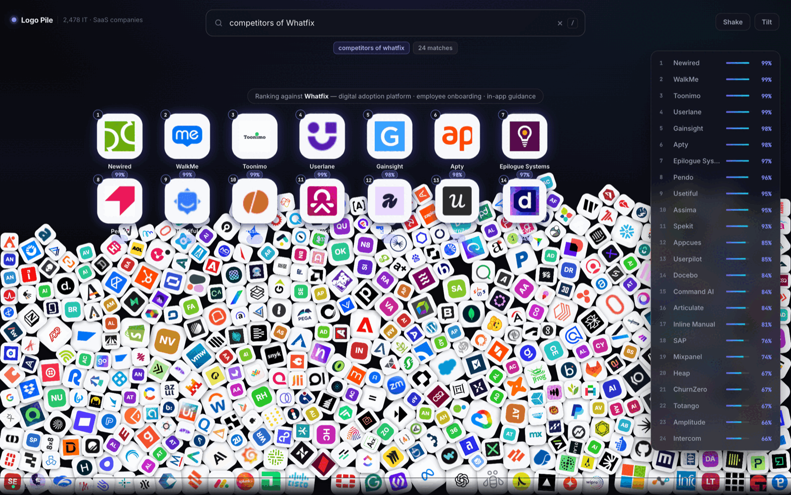
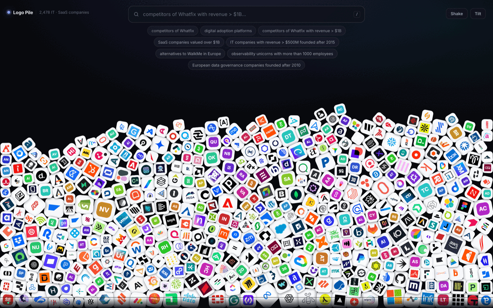
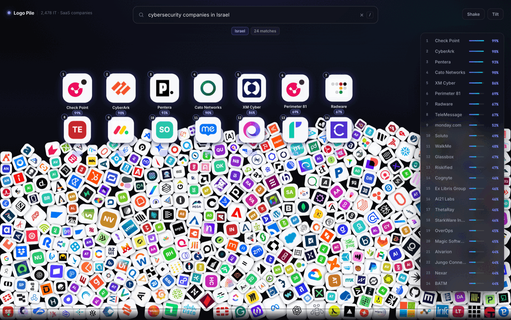

<div align="center">

# 🧱 Logo Pile

**A physics pile of 2,478 IT & SaaS logos. Ask in plain English, watch the answers fly out.**

[](https://rehmanalimomin.github.io/logopile/)

[](https://github.com/RehmanaliMomin/logopile/actions/workflows/deploy.yml)


<br />



<sub><i>`competitors of Whatfix` → Newired, WalkMe, Toonimo, Userlane, Gainsight, Apty… the actual digital-adoption category, ranked.</i></sub>

</div>

---

## Try these

Paste any of these into the [live demo](https://rehmanalimomin.github.io/logopile/):

| Query | What it exercises |
|---|---|
| `competitors of Whatfix` | competitor graph + semantic neighbours |
| `nightfall direct competetors` | typo tolerance + word order (yes, misspelled on purpose) |
| `competitors of Whatfix with revenue > $1B` | competitor intent **and** a hard financial filter |
| `SaaS companies valued over $1B founded after 2015` | two structured filters, no target |
| `alternatives to WalkMe in Europe` | competitor intent + region |
| `observability unicorns with more than 1000 employees` | unicorn flag + headcount |
| `European data governance companies founded after 2010` | region + year + semantic topic |
| `who competes with CrowdStrike` | a third phrasing of the same intent |
| `cybersecurity companies in Israel` | breadth — Pentera, Cato, XM Cyber, none of them hand-written |
| `competitors of ACI Worldwide` | an *inferred* edge — nobody wrote this graph by hand |
| `SaaS companies that are not American` | negation, which used to invert the filter |
| `bootstrapped companies with more than 1000 employees` | a pure-filter query with no search terms at all |

Or press **More ↻** under the search box to page through the rest — there are over 600.
**Filters** turns the same constraints into controls, and every search is a shareable link (`?q=…`).
**Sort** splits the heap into zones by what each company does.

Everything runs in your browser. No key, no server, no signup.

<details>
<summary><b>The suggestions are generated from the data, not hardcoded</b></summary>

<br />

A fixed list goes stale the moment the dataset changes, and can offer a query
that returns nothing. `src/search/suggestions.ts` builds them from counts taken
off the corpus instead — a category/country pair is only suggested when at least
three companies satisfy it, so "cybersecurity companies in Israel" exists because
nine of them do, not because someone guessed.

Eight showcase queries stay pinned at the front (each exercises a hard code path:
typo tolerance, negation, pure filters, competitor intent); the remaining ~600
are shuffled per load, so a reload offers a different slice.

`node scripts/validate-suggestions.mjs` runs every single one through the ranker
and fails if any returns zero results. Currently 617/617.

</details>

---

## Contents

- [How it works](#how-it-works)
- [The five signals](#the-five-signals)
- [Competitor logic](#competitor-logic)
- [Physics](#physics)
- [Run it locally](#run-it-locally)
- [Adding companies](#adding-companies)
- [Where to get more data, free](#where-to-get-more-data-free)
- [Making the numbers accurate](#making-the-numbers-accurate)
- [Optional: calibrated confidence with Laya](#optional-calibrated-confidence-with-laya)
- [Project structure](#project-structure)
- [Known limits](#known-limits)

---

## How it works

```
query
  │
  ├─ parse ─────────── pull out filters and competitor intent, leave the rest as text
  │                    revenue · valuation · employees · founded · funding · region · stage
  ├─ hard filter ───── drop anything that fails a threshold (and count what had no data)
  ├─ score ─────────── semantic · lexical · category · competitor graph · prominence
  ├─ confidence ────── 40% relative to the best hit + 60% absolute
  ├─ [Laya] ────────── optional calibrated rerank of the top 30
  └─ pile.show() ───── matched bodies leave the collision graph and spring into a grid
```

Ranking is **hybrid** on purpose. Pure vector search returns plausible-looking neighbours
for everything; pure keyword search misses "digital adoption" ↔ "in-app guidance". The
filters are hard gates, not score nudges — `revenue > $1B` means *no*, not *less likely*.

<details>
<summary><b>Why the search box works before the model loads</b></summary>

<br />

The corpus embeddings are precomputed at build time and shipped as a 420 KB `Float32`
blob. The browser only ever embeds **your query**, and it pulls transformers.js from a
CDN lazily.

So the app boots instantly, lexical + filter search answers immediately, and the
semantic signal folds in when the model lands (the status bar tells you which mode
you're in). If the CDN never responds, ranking drops the semantic term and reweights
the rest — there is no error state for the user.

</details>

<details>
<summary><b>How confidence is calculated, and what it isn't</b></summary>

<br />

```
confidence = 0.4 × (score / bestScore)^1.15  +  0.6 × min(1, score / 0.72)
```

The relative half makes the leader of a good result set read high. The absolute half
stops a thin result set from normalising its best bad answer up to 100% — a real bug
this had early on, where three weak survivors of a tight filter all printed 99%.

It is still a **relevance ordering rescaled to 0–100**, not a probability. If you want
the number to actually mean something, see [Laya](#optional-calibrated-confidence-with-laya).

</details>

---

## The five signals

| signal | what it measures | plain query | `competitors of X` |
|---|---|:--:|:--:|
| **semantic** | cosine of MiniLM embeddings, query vs. product description | `0.54` | `0.28` |
| **lexical** | BM25 over the same text | `0.25` | `0.07` |
| **category** | overlap of category tags | `0.14` | `0.25` |
| **competitor** | `1.0` direct graph edge, `0.55` shared-competitor | — | `0.32` |
| **prominence** | log-scaled valuation, `0..1` | `0.07` | `0.08` |

`prominence` is a deliberate tiebreak, not a ranking signal. Without it, tiny pure-play
vendors outranked WalkMe on `competitors of Whatfix` — technically defensible, obviously
not what you meant.

---

## Competitor logic

`competitors of X` · `alternatives to X` · `X competitors` · `who competes with X` · `X rivals`

1. **Find the keyword** by bounded Levenshtein distance, so `competetors` and
   `alternatves` land. Filler adjectives (`direct`, `main`, `closest`, `top`) between the
   name and the keyword get stripped.
2. **Resolve X** — exact name → id → domain → prefix → substring.
3. **Exclude X** from its own results.
4. **Use X's own precomputed vector** as the query vector instead of re-embedding its
   description. It is the exact point in space we want neighbours of.
5. **Score the graph**: direct edges `1.0`, second hop `0.55` — companies fought over by
   X's own competitors are usually competitors too, even when nobody wrote that edge.

If X isn't in the dataset, you get **zero results and a message saying so**. The earlier
behaviour — ranking everything against nothing, which floated the biggest logos to the
top — looked like a confident answer and was worse than no answer.

The graph is symmetrised at build time: write `A → B` once and `B → A` appears for free.

---

## Physics



Matter.js runs the heap — 500 chamfered bodies, real collisions, draggable.

The dataset is five times that. Matter is comfortable with a few hundred
colliding bodies and not with thousands, so **the pile is a viewport, not the
whole corpus**: it holds the most prominent 500, and anything else that matches
a query is spawned on demand from below the floor and removed again on release.
Search always covers all 2,478.

Matched tiles **do not stay in the simulation**. They get `collisionFilter.mask = 0` and
are moved by a critically-damped spring integrated outside Matter. Physics for the pile,
deterministic easing for the answer; letting gravity and neighbours near the result grid
turns it into a jostling mess.

**The heap sinks to make room.** Results need headroom, and the honest way to get it is to
move the pile rather than draw the grid on top of it: when an answer comes up, the heap is
rendered up to a third of the viewport lower and dimmed behind a scrim, then eases back when
the query clears. Physics never sees the offset — it is applied at draw time, and to
hit-testing too, so clicks stay accurate while the pile is displaced.

Each flying tile carries its name and score on one solid plate. Text drawn straight over the
pile is unreadable the moment a bright logo lands behind it.

Tiles are sized by `log10(valuation)`, so the pile has visual hierarchy even at rest.

Every tile is a **pre-baked sprite** (rounded plate + drop shadow + logo, drawn once to an
offscreen canvas and blitted thereafter). Re-drawing 500 rounded rects with `shadowBlur`
each frame cost 34 fps — and none of it showed up in a JS profiler, because the expense is
rasterisation, not script. Frame budget is now ~6.5 ms of the 16.6 ms available.

<details>
<summary><b>Interaction reference</b></summary>

<br />

| | |
|---|---|
| `/` | focus search |
| `Esc` | blur search |
| drag | throw a logo around |
| click | open its detail card |
| **Shake** | kick the pile |
| **Tilt** | DeviceOrientation — tilt your laptop or phone to shake the heap (iOS asks permission) |

</details>

---

## Run it locally

```bash
git clone https://github.com/RehmanaliMomin/logopile.git
cd logopile
npm install
npm run dev          # → http://localhost:5188
```

`companies.json` and `embeddings.bin` are committed, so this works immediately — no
model download on the critical path. Total payload is about 1 MB: the corpus vectors are
quantised to **int8** (`v × 127`, rounded), which costs ~0.4% cosine error and cuts the
blob from 3.8 MB to 0.95 MB. Float32 does not compress; int8 does.

<details>
<summary><b>All commands</b></summary>

<br />

| command | does |
|---|---|
| `npm run dev` | dev server on :5188 |
| `npm run build` | typecheck + production bundle |
| `npm run data` | rebuild `companies.json` **and** `embeddings.bin` |
| `npm run embed` | embeddings only (~25 MB model download on first run) |
| `npm run ingest:edgar` | dry-run SEC revenue diff (`-- --write` to apply) |
| `npm run ingest:wikipedia` | re-ingest the bulk tier from Wikipedia + Wikidata |
| `node scripts/stress.mjs` | 28 deliberately awkward queries — typos, negation, pure filters |
| `node scripts/validate-suggestions.mjs` | assert every generated suggestion returns results |
| `node scripts/smoke.mjs` | run the ranker over example queries in Node |
| `node scripts/smoke.mjs --semantic` | same, with embeddings on |

`scripts/smoke.mjs` is the fastest way to judge a ranking change — it prints the parsed
filters and the top 8 hits for a dozen queries in about a second.

</details>

---

## Adding companies



The dataset is two tiers. `data/seed/0*.json` is **curated** — hand-written descriptions,
category tags, financials and competitor edges. `data/seed/90-wikipedia.json` is
**ingested** in bulk and always loses to a curated row on the same id or domain.

1. Drop a new `data/seed/06-whatever.json` (a JSON array) or extend an existing slice.
2. `npm run data`

The build validates required fields, symmetrises the competitor graph, and **prints every
edge pointing at a company that isn't in the dataset** — so the graph tells you what to
add next. If it exists under a different slug, add it to `ALIAS` in
`scripts/build-dataset.mjs` instead.

<details>
<summary><b>Data schema</b></summary>

<br />

```jsonc
{
  "id": "whatfix",                    // stable slug, used for competitor edges
  "name": "Whatfix",
  "domain": "whatfix.com",            // drives the logo URL
  "description": "…",                 // 1–2 sentences; this is what gets embedded
  "categories": ["digital adoption platform", "in-app guidance", "saas"],
  "hqCity": "San Jose",
  "hqCountry": "United States",
  "region": "North America",          // North America | Europe | Asia | Asia Pacific | Middle East
  "founded": 2014,
  "employees": 1100,
  "stage": "series-e",                // public | private | bootstrapped | acquired | seed | series-a…g | late-stage
  "ticker": null,                     // set it and EDGAR can fill real revenue
  "revenueUsd": 100000000,
  "revenueEstimated": true,           // renders an "est" tag in the UI
  "valuationUsd": 600000000,
  "valuationEstimated": true,
  "fundingTotalUsd": 265000000,
  "competitors": ["walkme", "pendo"]  // write each edge once; the build symmetrises
}
```

Derived at build time, never hand-written: `isUnicorn`, `logo`, `logoFallback`, `searchText`.

Every field may be `null` except `id`, `name`, `domain`, `description`, `categories`.
A numeric filter excludes rows whose field is `null`, but the count is reported in the
status bar rather than silently dropped.

</details>

---

## Where to get more data, free

| source | what you get | how |
|---|---|---|
| **Wikipedia + Wikidata** | ~2,200 companies with a real intro paragraph, HQ, founding year | `npm run ingest:wikipedia` (already run — this is the bulk tier) |
| **SEC EDGAR** | real annual revenue for every US-listed company, no key | `npm run ingest:edgar -- --write` (matches on `ticker`) |
| **SEC `company_tickers.json`** | the full list of US public companies + CIKs | seed `id`/`ticker`/`name`, then EDGAR for financials |
| **Wikidata SPARQL** | founded year, HQ, employees, industry | public endpoint, no key |
| **Unicorn lists** (CB Insights, Crunchbase) | valuation + funding for private unicorns | published as HTML tables, scrape once into a slice |
| **Companies House / OpenCorporates** | UK & EU registered entities | free tiers — good for the Europe coverage gap |

Higher-resolution logos, if you have a provider key:

```bash
LOGO_CDN='https://cdn.brandfetch.io/{domain}/w/256/h/256?c=YOUR_KEY' npm run data
```

Default is Google's keyless favicon service (128 px) with DuckDuckGo as backstop and a
generated monogram tile if both fail — nothing ever renders as a broken image.

---

## Making the numbers accurate

<details open>
<summary><b>Financial filters</b></summary>

<br />

- **Public companies** — run the EDGAR ingest. It sets `revenueEstimated: false`. Never
  hand-type these; they go stale every quarter and EDGAR is free.
- **Private companies** — leave `revenueEstimated: true`. An estimate that is *labelled*
  is useful; one pretending to be reported is not.
- **Valuation for public companies** is market cap, which moves daily, so it's marked
  estimated on purpose. Wire a quotes API if you need it live.
- **Revenue vs ARR** — the schema has one field. For SaaS privates the figure is ARR; for
  public companies it's GAAP annual revenue. Split the field if that matters to you.

</details>

<details open>
<summary><b>Competitor search</b></summary>

<br />

The graph is the highest-leverage thing in the whole app — one correct edge beats a lot of
embedding tuning. In order of payoff:

1. **Add edges**, especially in the categories you care about. They're symmetrised, so
   each is one line.
2. **Make descriptions discriminative.** "Cloud software for business" embeds near
   everything. Name the product, the buyer, and the mechanism.
3. **Keep categories tight.** They carry `0.25` weight on competitor queries; twelve loose
   tags per company dilutes that.
4. **Turn on Laya** if you want the percentage to be a real probability.

</details>

---

## Optional: calibrated confidence with Laya

[Laya](https://github.com/NandhaKishorM/laya) (Apache-2.0) is a non-autoregressive
decision engine and an open alternative to TypeSafe's Jev. Its `noul` head returns a
calibrated yes/no probability in ~33 ms on GPU, which is exactly what this UI's badge
claims to be showing. The integration is wired, working, and **off by default** — because
I ran it, and on this task it makes the ordering worse.

<details open>
<summary><b>What it actually scored</b></summary>

<br />

laya 0.3.4, `convaiinnovations/laya`, asking *"Is this company a direct competitor of
Whatfix, a digital adoption platform?"*:

| company | `noul` | should be |
|---|--:|---|
| Userlane | 0.830 | ✅ high — direct DAP rival |
| WalkMe | 0.814 | ✅ high — the category's pioneer |
| **Stripe** | **0.770** | ❌ a payments company, should be near zero |
| Toast | 0.586 | ❌ restaurant POS |
| **Pendo** | **0.506** | ❌ an actual rival, scored at chance |
| NVIDIA | 0.258 | ✅ low |

It separates the obvious extremes but ranks Stripe above Pendo. End-to-end through the
app, reranking demotes WalkMe from #1 to #4 and Pendo from #8 to #7 while promoting
Spekit to the top. The `typed-decisions` checkpoint was flatter still — every company
between 0.35 and 0.50, with Stripe (0.464) edging out WalkMe (0.459).

This is a zero-shot open-domain judgement about company competition, which is not what
the model is trained for; its own examples are ticket triage, moderation and guardrails.
A fine-tune on competitor pairs would be the fair test and I have not run one.

</details>

<details>
<summary><b>Running it anyway</b></summary>

<br />

`pip install "laya[serve]"` advertises FastAPI + uvicorn but installs neither at 0.3.4,
and there is no `laya-serve` entry point, so `tools/laya_server.py` is a standard-library
server speaking the documented `/v1/systemone` API.

```bash
python3 -m venv .venv && .venv/bin/pip install laya
HF_TOKEN=<your token> .venv/bin/python tools/laya_server.py
echo 'VITE_LAYA_URL=http://localhost:8000' >> .env.local
```

The top 12 hits get rescored by `P(direct competitor of X)`, four requests in flight at a
time, since the API scores one company per call. Every failure mode — unset, down, slow,
malformed, all-null — falls back to the local score with nothing surfaced to the user. The
status bar reads `Laya calibrated` only when a rerank actually landed.

**A note on the first version of this adapter:** it posted to `/v1/decide` with a batched
`inputs` array and read `results[].probability`. None of that exists — I wrote it from an
assumed API shape and never ran a server against it. It would have failed every call and
fallen back silently, forever, looking like it worked.

</details>

## Project structure

```
data/seed/*.json                hand-curated slices — add files, merged in order
scripts/
  build-dataset.mjs             merge, validate, symmetrise the graph, derive fields
  build-embeddings.mjs          MiniLM → public/embeddings.bin (int8, L2-normalised)
  ingest-wikipedia.mjs          Wikipedia + Wikidata → the bulk tier (2,199 rows)
  ingest-edgar.mjs              SEC EDGAR → real revenue for tickered companies
  smoke.mjs                     Node harness: run the ranker over example queries
  stress.mjs                    adversarial queries — typos, negation, pure filters
  validate-suggestions.mjs      assert every suggestion returns results
  resolve-tickers.mjs           match company names against SEC registrants
  infer-competitors.mjs         k-NN competitor edges for rows with none
  build-clusters.mjs            assign each company a visual zone
tools/laya_server.py            stdlib /v1/systemone server for the optional reranker
src/
  search/parse.ts               NL → filters + target + leftover semantic text
  search/bm25.ts                tiny in-memory BM25
  search/embed.ts               query-side embedding, lazy from CDN, swappable
  search/rank.ts                the blend
  search/suggestions.ts         query suggestions generated from corpus counts
  ui/FilterPanel.tsx            structured filters that compose into the query text
  search/laya.ts                optional calibrated reranker
  physics/pile.ts               Matter world, spring layout, canvas rendering
  physics/logos.ts              logo fallback chain
  ui/                           App · SearchBar · DetailCard
public/companies.json           generated — do not edit
public/embeddings.bin           generated — committed so clone-and-run works
```

<details>
<summary><b>Swapping the embedding model</b></summary>

<br />

`src/search/embed.ts` exports `setEmbedder(fn)`. Anything returning L2-normalised vectors
works, as long as `scripts/build-embeddings.mjs` uses the same model and dimension.

`bge-small-en-v1.5` is the obvious upgrade — 384-dim, same shape, better retrieval. Change
`MODEL` in both places and re-run `npm run data`.

</details>

---

## Known limits

- **Two tiers of data.** 279 curated rows carry competitor edges, revenue and valuation.
  The 2,199 ingested rows carry a description, categories, HQ and founding year — but no
  financials, so any revenue or valuation filter silently narrows to the curated tier (the
  status bar reports how many rows were dropped for missing data).
- **455 of the ingested rows have inferred edges**, generated by k-NN rather than asserted
  by anyone, and scored below a stated edge. The remaining 1,719 fall back to semantics and
  category overlap alone.
- **Valuations are approximate market caps**, not live quotes.
- **`requestAnimationFrame` pauses in background tabs**, so the pile freezes and resumes.
  That's correct browser behaviour, not a bug.
- **Mobile works but is cramped.** Verified at 390×844 and 768×1024: 60 fps, no horizontal
  scroll, body count scaled to viewport, and the results rail becomes a bottom sheet so all
  matches stay reachable when only three fit in the grid.
- **No image-based (logo similarity) search.** The hook exists — `setEmbedder` plus a CLIP
  image tower — and the corpus blob format already supports it.

---

<div align="center">
<sub>MIT · built with Claude Code</sub>
</div>
